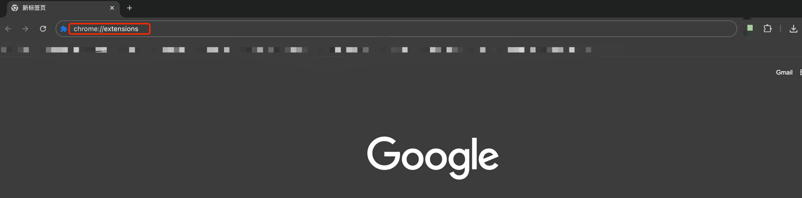
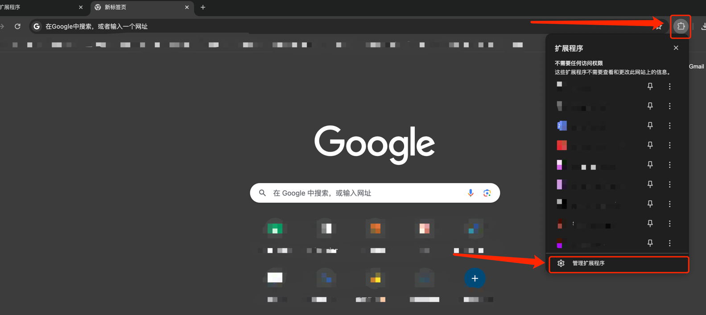
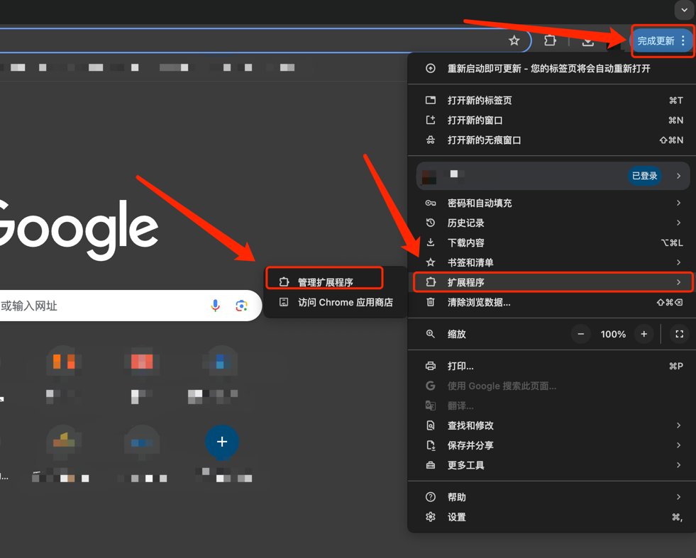
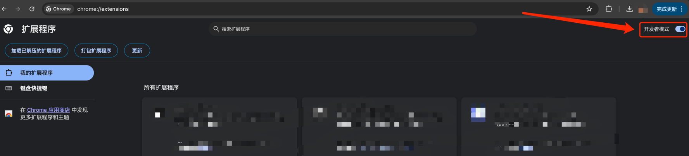
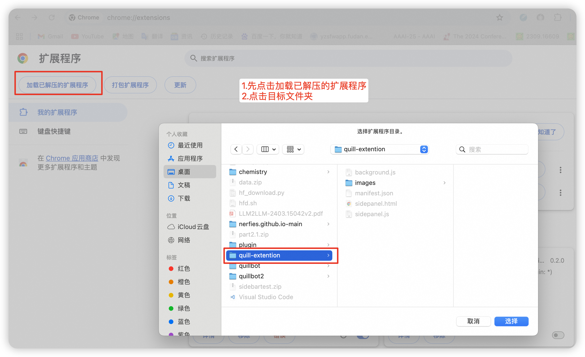

<p align="left">
    <a href="README_CN.md">中文</a>&nbsp ｜ &nbspEnglish&nbsp
</p>
<br>

# 项目简介

quill-extention是专为[论文](https://gracexiaoo.github.io/quill.github.io/)设计的一款chrome extension，支持文本润色改写和引经据典改写。

# 使用说明

## 1. 获取源码

```
git clone git@github.com:GraceXiaoo/quill-extention.git ~/quill-extension
```

## 2. 获取源码

#### 2-1、打开 Chrome 浏览器，然后打开**插件管理页面**

有多种方式都可以打开，以下，我提供三种方式，任选其一即可。

- 第一：可以直接访问 `chrome://extensions` 进行打开；



- 第二：通过「扩展程序」->「管理扩展程序」进行打开；



- 第三：通过「设置」->「扩展程序」->「管理扩展程序」进行打开；



#### 2-2、开启「开发者模式」



一定要开启「开发者模式」。

#### 2-3、加载插件



点击左上角的「加载已解压的扩展程序」，然后直接选择插件目录即可。

> 这里选择的目录，就是刚刚第一步，你下载源码后的那个目录。


然后我们就可以看到插件已经安装成功了！现在就好好的玩耍吧！

## 引用
```
@article{xiao24quill
  author    = {JinXiao, BoweiZhang, QianyuHe, JiaqingLiang, FengWei, JingleiChen, ZujieLiang, DeqingYang, YanghuaXiao},
  title     = {QUILL: Quotation Generation Enhancement of Large Language Models},
  year      = {2024},
}
```


